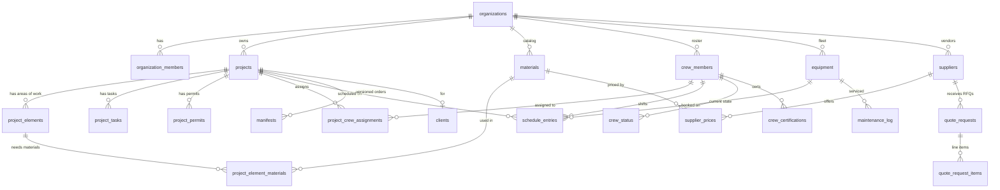

# TerrainForge — Entity Relationship Diagram

> **Generated:** 2026-04-17 from live Supabase, header-refreshed 2026-04-30 after migration 036.
> **Schema state:** 36+ tables (added share_tokens, project_design_versions, manifests since gen), 36 migrations applied (001-036).
> **Source of truth:** the live Supabase schema. This doc mirrors it; do not hand-edit
> without regenerating from `information_schema`.
>
> **Migrations 028-036 added since this doc was generated** (not yet reflected in the
> diagrams below — query live for the current state):
> - **028** — `project_elements.geometry` JSONB, `projects.site_geometry` JSONB,
>   `project_share_tokens` table + RLS + anon policies, `bump_share_token_view` RPC
> - **029** — `project_share_tokens.client_response/responded_at/note` +
>   `respond_to_share_token` RPC (client approve/reject)
> - **030** — `materials.texture_albedo_url / normal_url / roughness_url`
>   (PBR textures for 3D viewer)
> - **031** — Phase C v0 client-design RPCs (SECURITY DEFINER, token-scoped UPDATE)
> - **032** — `project_design_versions` table (client-submitted design snapshots)
> - **033** — `project_elements.shape` (`rectangle | circle | polygon | polyline`)
>   + `radius_ft` for circles
> - **034** — extends shape CHECK to allow `polygon` (Shoelace area, segment perimeter)
> - **035** — `projects.lot_geometry / buildable_area_geometry / obstacles_geometry`
>   JSONB (Sprint AI-Buildable polygons)
> - **036** — `suppliers.short_code` (org-scoped unique TEXT, 2-6 chars,
>   prefixes SKUs at CSV import)

---

## At a glance

34 tables across 9 domains. Every tenant-scoped table has `org_id uuid → organizations.id`.
RLS enforced on all of them; as of migration 027 every policy wraps `auth.*()` in a
subselect (performance) and org-scoping reads via `organization_members`.

```
auth/org            projects/elements         materials/suppliers
├─ organizations    ├─ projects               ├─ materials
├─ organization_    ├─ clients                ├─ suppliers
│  members          ├─ project_elements       ├─ supplier_prices
├─ invitations      ├─ project_element_       ├─ quote_requests
├─ user_            │  materials              └─ quote_request_items
│  preferences      ├─ project_tasks
├─ audit_log        ├─ project_permits        manifests (versioned)
└─ dashboard_       ├─ project_subcontractors └─ manifests
   config           ├─ project_site_
                    │  conditions             zones (LEGACY)
crew                ├─ project_documents      ├─ zones
├─ crew_members     ├─ project_crew_          ├─ zone_materials
├─ crew_            │  assignments            └─ zone_equipment
│  certifications   └─ project_materials
├─ crew_checklist_     (LEGACY — use
│  progress            project.materials      equipment/schedule
├─ crew_photos         JSONB instead)         ├─ equipment
└─ crew_status                                ├─ maintenance_log
                                              └─ schedule_entries
```

---

## Core entity relationships (Mermaid)



---

## Table reference

Counts are `(columns, RLS policies, indexes)` as of migration 027.

### Auth / Organization domain

| Table | (c/p/i) | Purpose |
|---|---|---|
| **organizations** | 17/5/6 | Tenant root. `slug` + `shortcode` UNIQUE. Stripe fields + trial window. Default labor/equipment rates + disposal rates (jsonb). |
| **organization_members** | 7/5/4 | Join user ↔ org with role enum (`admin`/`designer`/`foreman`/`client`). `invited_at`/`accepted_at` track lifecycle. |
| **invitations** | 8/3/3 | Pending invites. Token + expiry + role. |
| **user_preferences** | 16/4/4 | Per-user prefs: selected KPIs, widget layout, notifications, theme, onboarding state. |
| **audit_log** | 8/2/3 | Typed audit entries. INSERT policy (as of mig 027) requires `auth.uid() IS NOT NULL`. |
| **dashboard_config** | 6/3/4 | Per-user dashboard widget config (jsonb). Scoped per org. |

### Projects domain

| Table | (c/p/i) | Purpose |
|---|---|---|
| **projects** | 57/4/2 | The center of gravity. Status enum: `estimate/quoted/approved/scheduled/in_progress/completed/on_hold`. Lifecycle timestamps: `approved_at`, `started_at`, `completed_at`. Holds `materials` JSONB (project-level quick list), wizard state, full site intel (soil/slope/drainage/HOA/etc), and a full budget roll-up (labor/materials/equipment/subcontractor/disposal/overhead/quote/profit). |
| **clients** | 9/4/2 | Client records (optional — projects can be client-less via inline `client_name` fields). |
| **project_elements** | 15/4/2 | **Measurement-driven core.** 24 element types (patio, wall, garden_bed, sod_area, edging, walkway, driveway, retaining_wall, fire_pit, pool_deck, parking_lot, steps_stairs, fence, pergola, outdoor_kitchen, drainage, tree_planting, shrub_planting, irrigation_zone, mulch_area, gravel_area, concrete_slab, curbing, other). Dimensions drive all material quantities via the engine. |
| **project_element_materials** | 18/4/4 | Junction: element ↔ material with per-instance override columns (`spacing_override_inches`, `waste_factor_override`, `manual_count`, `wall_length_ft`, `wall_height_ft`, `computation_model`). Feeds the manifest engine. |
| **project_materials** | 7/4/3 | **LEGACY — prefer `projects.materials` JSONB.** Flat join that predates the element-based architecture. Kept for compat; audit recommends deletion in a follow-up migration. |
| **project_tasks** | 19/4/6 | Task list with phase, sequence, depends-on graph (uuid[]), man-hours, assigned crew, ai metadata. |
| **project_permits** | 18/4/3 | Per-project permits with jurisdictional tracking. |
| **project_subcontractors** | 17/4/3 | External trade partners with quoted vs actual cost. |
| **project_site_conditions** | 10/4/3 | AI-inferred or manual site conditions. |
| **project_documents** | 11/4/3 | Storage-path references to Supabase Storage objects. |
| **project_crew_assignments** | 6/4/5 | Persistent crew-to-project assignments. UNIQUE (project_id, crew_member_id). |

### Manifests (versioned snapshots)

| Table | (c/p/i) | Purpose |
|---|---|---|
| **manifests** | 9/3/1 | Versioned manifest snapshots per project. `line_items`, `purchase_list`, `summary` all JSONB. **Feature built but not yet wired** — no code writes to this table as of Apr 17. |

### Materials & suppliers

| Table | (c/p/i) | Purpose |
|---|---|---|
| **materials** | 27/4/4 | Org-level material catalog. Post-mig-026 gets full engine metadata: `computation_model`, `compute_params` (jsonb with `coverage_sqft_per_unit`, `depth_inches`, `length_per_unit_ft`, `spacing_inches`, `face_area_sqft_per_unit`, `overlap_factor`), `purchase_unit`, `qty_per_purchase_unit`, `cost_per_purchase_unit`, `default_waste_factor`, `supplier_sku`, `dependent_material_ids` (text[]), `is_active`. |
| **suppliers** | 13/4/1 | Supplier directory with category tags and contact info. |
| **supplier_prices** | 13/4/4 | Material×supplier pricing with `is_preferred` flag, SKU, lead time, MOQ. |
| **quote_requests** | 13/4/1 | RFQ envelopes per supplier per project. Status lifecycle: `draft/sent/received/accepted/declined/expired`. |
| **quote_request_items** | 10/1/3 | Per-material line items on a quote request. |

### Crew

| Table | (c/p/i) | Purpose |
|---|---|---|
| **crew_members** | 15/5/3 | Crew roster. Roles (post-mig-025): `owner/foreman/lead/installer/laborer/specialist/apprentice`. Linked to Supabase auth via `user_id`. |
| **crew_certifications** | 6/4/2 | Expirable certs per crew member. |
| **crew_checklist_progress** | 7/3/6 | Per-zone step completion log. |
| **crew_photos** | 9/3/5 | Field photo uploads with zone/step context. |
| **crew_status** | 9/4/4 | Real-time crew state: `off_duty/en_route/on_site/on_break/done`, with lat/lng. |

### Equipment & schedule

| Table | (c/p/i) | Purpose |
|---|---|---|
| **equipment** | 29/4/3 | Fleet record with maintenance cadence, insurance, registration. Status: `available/in-use/maintenance/out-of-service`. `equipment_type` enum: landscaping-specific (excavator, skid-steer, dump-truck, etc.). |
| **maintenance_log** | 11/4/3 | Time-stamped service entries per equipment. |
| **schedule_entries** | 12/5/5 | Day-level schedule items. Links crew × equipment × project × date. Status: `scheduled/in_progress/completed/cancelled`. |

### Zones (legacy, pre-elements)

Pre-dates the `project_elements` architecture. Still present for backward-compat with
old projects. New work should target project_elements + project_element_materials.

| Table | (c/p/i) | Purpose |
|---|---|---|
| **zones** | 12/4/4 | Named area with area_sqft + perimeter. |
| **zone_materials** | 5/4/4 | Zone ↔ material quantity. |
| **zone_equipment** | 4/4/4 | Zone ↔ equipment. |

---

## Known legacy / redundancy

1. **`project_materials` is redundant with `projects.materials` JSONB.** The engine reads from the JSONB blob; the flat table is untouched. Candidate for drop in a future migration.
2. **Zone tables (`zones`, `zone_materials`, `zone_equipment`) are legacy.** Still wired into a few read paths (e.g., `generateSteps()` in `src/lib/workorders.ts`) and the `zone_materials_view` policy chain. Migration path: port the remaining consumers to `project_elements`, then drop the three tables.
3. **Client data has two storage paths.** `clients` table is the canonical one, but projects also store inline `client_name/client_phone/client_email` for single-client use. Consolidate in a future pass.
4. **Postgres ENUMs still exist** (`org_role`, `audit_action`, `maintenance_type`) despite CLAUDE.md's "never ENUM" rule. These pre-date the rule; low priority to convert.

---

## Extension points for the 3D design app

The current schema already carries **90% of what a 3D client-facing designer needs**. The
`project_elements` table has dimensions (length, width, area, linear_ft, height, depth),
and `project_element_materials` already attaches the PBR-like properties (computation
model, waste factor, purchase unit). Mig 026 added `manifests` for versioned output.

What the 3D app needs layered on:

| Need | Where it goes |
|---|---|
| Position on property plane | New columns on `project_elements`: `position_x`, `position_y`, `rotation_deg`. Or a `geometry` JSONB for future flexibility. |
| Property ground plane / topology | New column on `projects`: `site_geometry` JSONB (boundary polygon, elevation samples, survey import). |
| Texture / PBR per material | New columns on `materials`: `texture_albedo_url`, `texture_normal_url`, `texture_roughness_url`, or a `textures` JSONB. Existing `ElementVisual.tsx` SVG patterns are a fallback. |
| Adjacency / grouping | New table `element_relationships` (element_a, element_b, relation_type: `adjacent`/`contained`/`elevated`). |
| Shared client link | New table `project_share_tokens` (project_id, token, role=`client_view_only`, expires_at). |
| Scene graph persistence | New table `project_scenes` (versioned JSONB of the full 3D composition) or extend `manifests` with a `scene` payload. |

---

## Regenerating this file

The source of truth is live Supabase `information_schema` + `pg_policies` + `pg_indexes`.
If this markdown drifts more than a week, re-query via Supabase MCP and regenerate. Count
columns from `information_schema.columns`, policies from `pg_policies`, indexes from
`pg_indexes`, all filtered to `schema='public'`.
